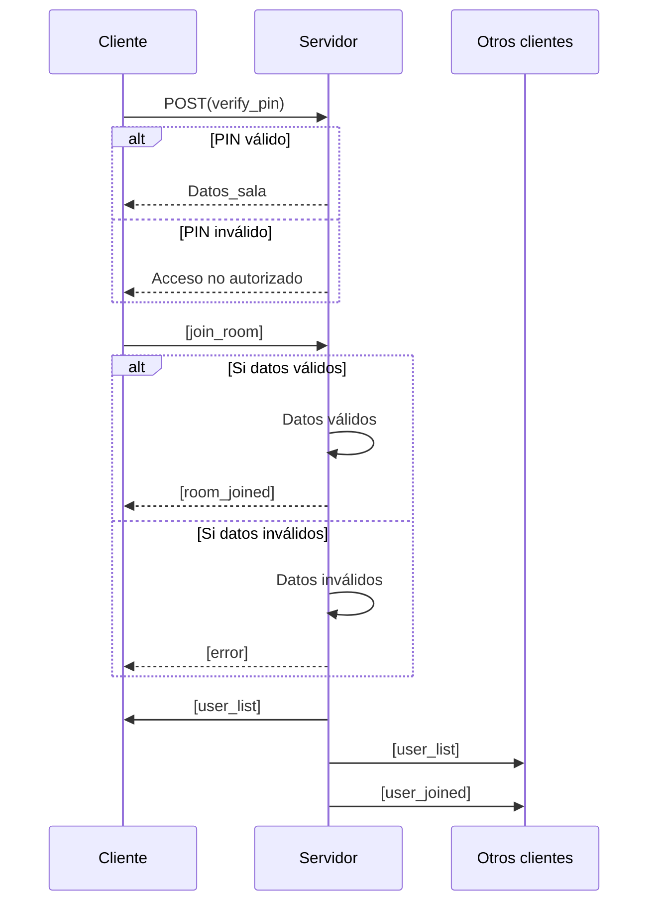
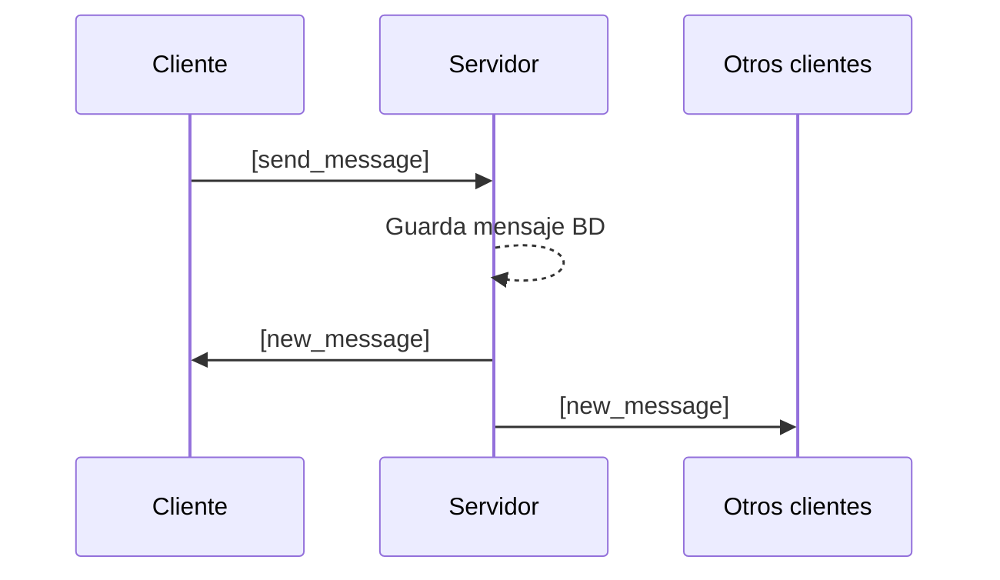
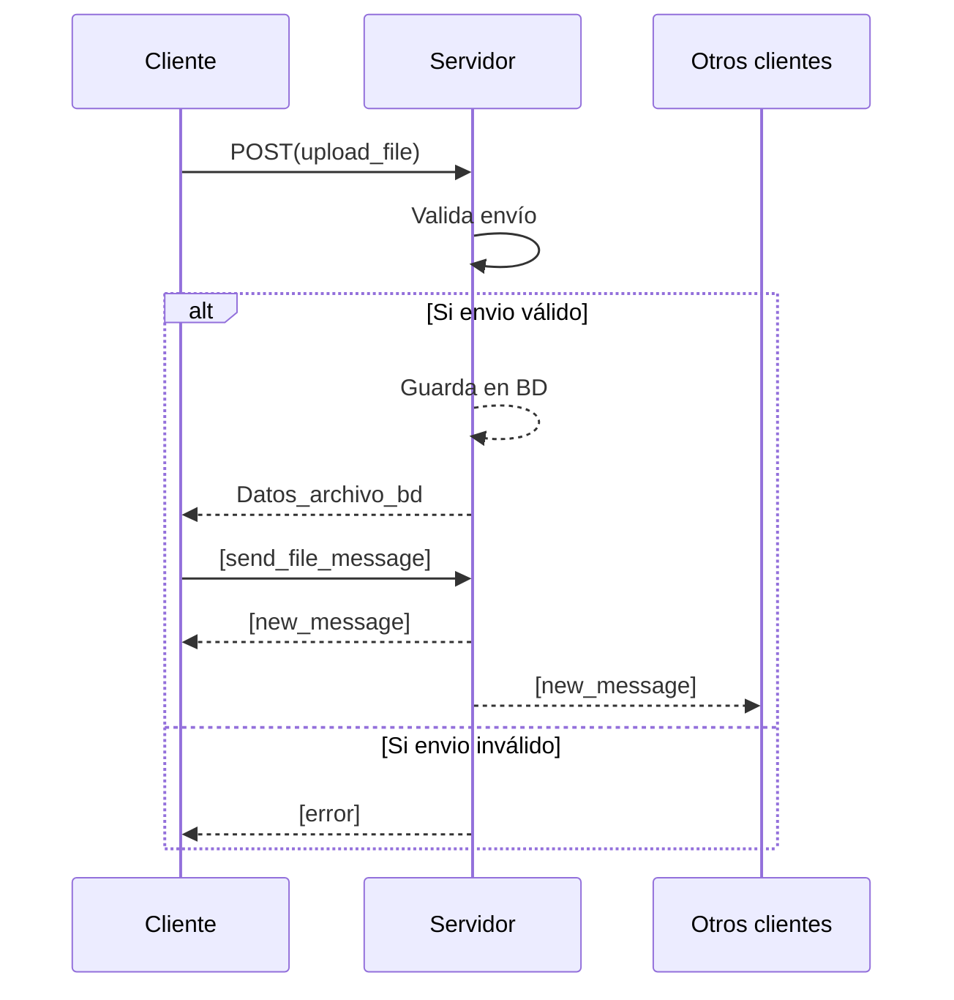
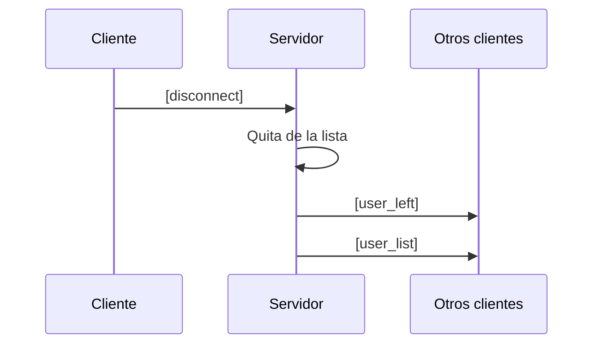

# 🚀 WebSockets — ChatApp

Backend de una aplicación de chat en tiempo real construido con **Flask**, **Flask-SocketIO**, **MongoDB** y **Redis**.

---

## 📋 Requisitos previos

| Herramienta | Versión mínima | Descarga |
|---|---|---|
| Python | 3.10+ | https://www.python.org/downloads/ |
| Docker Desktop | Cualquier versión reciente | https://www.docker.com/products/docker-desktop/ |
| Git | Cualquier versión | https://git-scm.com/ |

---

## 📂 Estructura del proyecto

```
backend/
├── src/
│   ├── app.py                  # Punto de entrada de la aplicación
│   ├── config/
│   │   ├── database.py         # Conexión a MongoDB
│   │   └── redis_client.py     # Conexión a Redis
│   ├── middleware/
│   │   └── auth.py             # Decorador JWT para rutas protegidas
│   ├── models/
│   │   ├── room.py             # Modelo de sala de chat
│   │   └── message.py          # Modelo de mensaje
│   ├── routes/
│   │   ├── auth.py             # POST /api/auth/login
│   │   ├── rooms.py            # CRUD de salas
│   │   └── upload.py           # Subida y descarga de archivos
│   ├── socket/
│   │   └── events.py           # Eventos WebSocket (join, message, disconnect)
│   └── workers/
│       └── broadcast.py        # Hilo para broadcast sin bloquear
├── uploads/                    # Archivos subidos (generado automáticamente)
├── .env                        # Variables de entorno (NO subir a Git)
├── .env.example                # Plantilla de variables de entorno
└── requirements.txt            # Dependencias Python

```

---

## ⚙️ Instalación paso a paso

### 1. Clonar el repositorio

```bash
git clone <URL_DEL_REPOSITORIO>
cd <nombre-del-proyecto>/backend
```

### 2. Crear y activar el entorno virtual

**Windows (PowerShell):**
```powershell
python -m venv venv
.\venv\Scripts\activate
```

**Linux / macOS:**
```bash
python3 -m venv venv
source venv/bin/activate
```

### 3. Instalar dependencias

```bash
pip install -r requirements.txt
```

### 4. Levantar MongoDB y Redis con Docker

Desde la **raíz del proyecto** (donde está el `docker-compose.yml`):

```bash
docker compose up -d
```

Verificar que los contenedores estén corriendo:

```bash
docker compose ps
```

Deberías ver:

```
NAME              STATUS
chatapp_mongo     Up
chatapp_redis     Up
```

### 6. Iniciar el servidor

Desde la carpeta `backend/` con el venv activado:

```bash
python -m src.app
```

El servidor estará disponible en: **http://localhost:3001**

---

## 🔌 Endpoints de la API REST

### Autenticación

| Método | Endpoint | Auth | Descripción |
|---|---|---|---|
| `POST` | `/api/auth/login` | ❌ | Login de administrador, devuelve JWT |

**Body:**
```json
{
  "username": "admin",
  "password": "Admin123"
}
```

**Respuesta:**
```json
{
  "token": "eyJhbGciOiJIUzI1NiIsInR5cCI6IkpXVCJ9..."
}
```

---

### Salas

| Método | Endpoint | Auth | Descripción |
|---|---|---|---|
| `POST` | `/api/rooms/` | ✅ JWT | Crear una nueva sala |
| `GET` | `/api/rooms/` | ✅ JWT | Listar todas las salas |
| `POST` | `/api/rooms/<room_id>/verify` | ❌ | Verificar PIN de una sala |

**Crear sala — Body:**
```json
{
  "name": "Sala General",
  "pin": "1234",
  "type": "text"
}
```
> `type` puede ser `"text"` o `"multimedia"`.

**Verificar PIN — Body:**
```json
{
  "pin": "1234"
}
```

Para las rutas con `✅ JWT`, incluye el header:
```
Authorization: Bearer <token>
```

---

### Archivos (solo salas multimedia)

| Método | Endpoint | Auth | Descripción |
|---|---|---|---|
| `POST` | `/api/upload/<room_id>` | ❌ | Subir un archivo |
| `GET` | `/api/upload/files/<filename>` | ❌ | Descargar/ver un archivo |

**Subida — form-data:**
| Campo | Tipo | Valor |
|---|---|---|
| `file` | File | Archivo JPG, PNG, GIF o PDF (máx 10MB) |
| `nickname` | Text | Nombre del usuario |

---

## 🔌 Eventos WebSocket

Conexión: `ws://localhost:3001`

| Evento (emit) | Datos | Descripción |
|---|---|---|
| `join_room` | `{ roomId, pin, nickname }` | Unirse a una sala |
| `send_message` | `{ content }` | Enviar mensaje de texto |

| Evento (on) | Descripción |
|---|---|
| `room_joined` | Confirmación de unión + historial de mensajes |
| `new_message` | Nuevo mensaje en la sala |
| `user_joined` | Alguien se unió a la sala |
| `user_left` | Alguien salió de la sala |
| `user_list` | Lista actualizada de usuarios en la sala |
| `error` | Error (PIN incorrecto, sala no encontrada, etc.) |

---

## 🐳 Comandos Docker útiles

```bash
# Levantar servicios en segundo plano
docker compose up -d

# Ver logs en tiempo real
docker compose logs -f

# Detener servicios (conserva los datos)
docker compose down

# Detener y borrar todos los datos (volúmenes)
docker compose down -v

# Reiniciar un servicio específico
docker compose restart mongo
```

---

## 🛑 Detener el servidor

En la terminal donde corre Flask, presiona `Ctrl + C`.

Para desactivar el entorno virtual:
```bash
deactivate
```

# Arquitectura 

```mermaid
  architecture-beta

  group frontend(cloud)[Frontend]
    service client(logos:vue)[Cliente Web] in frontend

    group backend(cloud)[Backend]
    service socket_server(server)[Socket Server] in backend
    service api_server(server)[API REST] in backend
    service thread_worker(logos:aws-opsworks)[Worker Broadcast] in backend

    junction server_sync in backend
    socket_server:T -- B:server_sync
    server_sync:T -- B:api_server

    group docker(logos:docker-icon)[Docker]
    group databases(database)[BD] in docker
    service mongo_db(logos:mongodb-icon)[MongoDB] in databases
    service redis_cache(logos:redis)[Redis] in docker

    junction db_conn
    api_server:R -- L:db_conn
    db_conn:R -- L:mongo_db
  
    junction cache_conn
    socket_server:R -- L:cache_conn
    cache_conn:R -- L:redis_cache

    junction client_socket
    client:R -- L:client_socket
    client_socket:R -- L:server_sync
```



# Diagramas de Secuencia


## Flujo 1 - Conexión al servidor


## Flujo 2 - Envío de mensaje de texto



## Flujo 3 - Enviar mensaje multimedia 


## Flujo 4 - Desconexión
