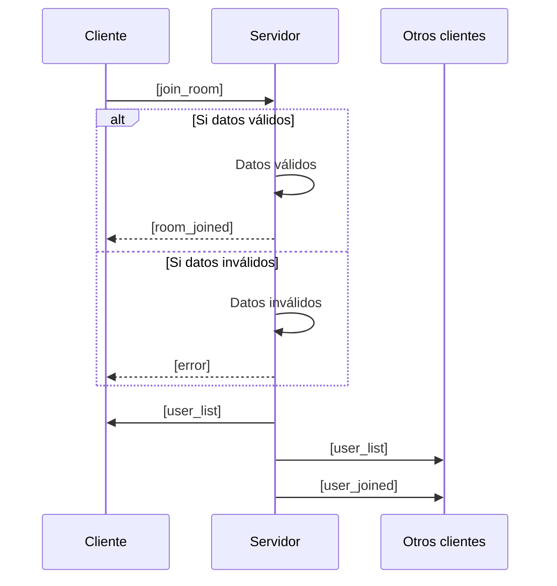
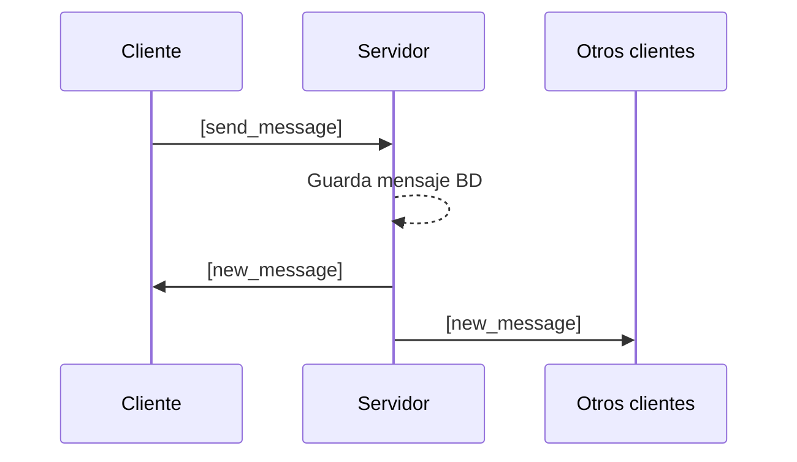
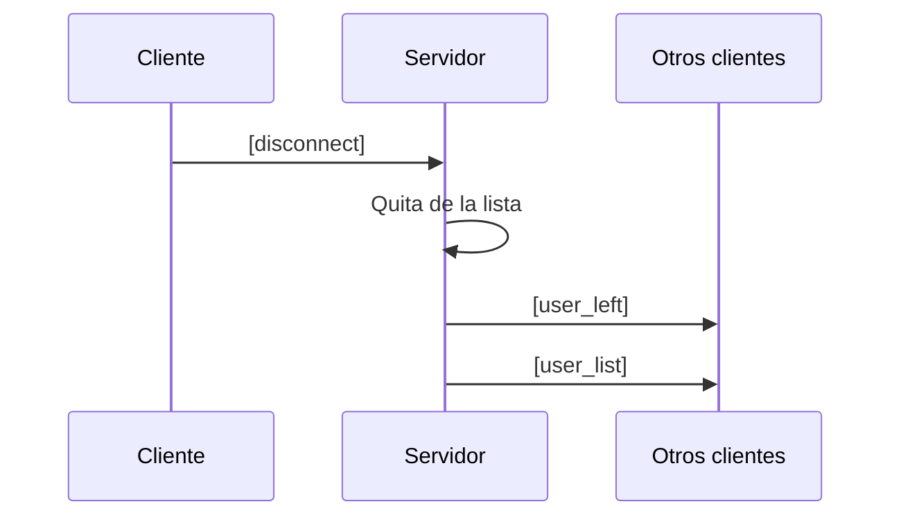

# Flujos de Comunicación

## Flujo 1 - Conexión al servidor

```mermaid
    sequenceDiagram
    participant C as Cliente
    participant S as Servidor
    participant O as Otros clientes

    C->>S: [join_room]
    
    alt Si datos válidos
        S->>S: Datos válidos
        S-->>C: [room_joined]
    else Si datos inválidos
        S->>S: Datos inválidos
        S-->>C: [error]
    end

    S->>C: [user_list]
    S->>O: [user_list]
    S->>O: [user_joined]
```

## Flujo 2 - Envío de mensaje de texto

```mermaid
sequenceDiagram
    participant C as Cliente
    participant S as Servidor
    participant O as Otros clientes

    C->>S: [send_message]
    S-->>S: Guarda mensaje BD
    S->>C: [new_message]
    S->>O: [new_message]
```

## Flujo 3 - Desconexión

```mermaid
sequenceDiagram
    participant C as Cliente
    participant S as Servidor
    participant O as Otros clientes

    C->>S: [disconnect]
    S->>S: Quita de la lista
    S->>O: [user_left]
    S->>O: [user_list]
```