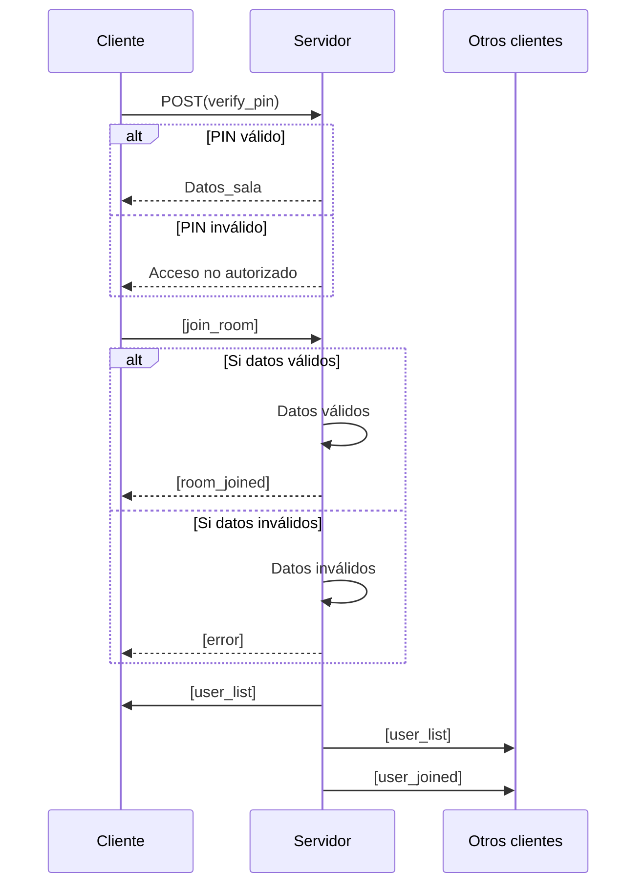
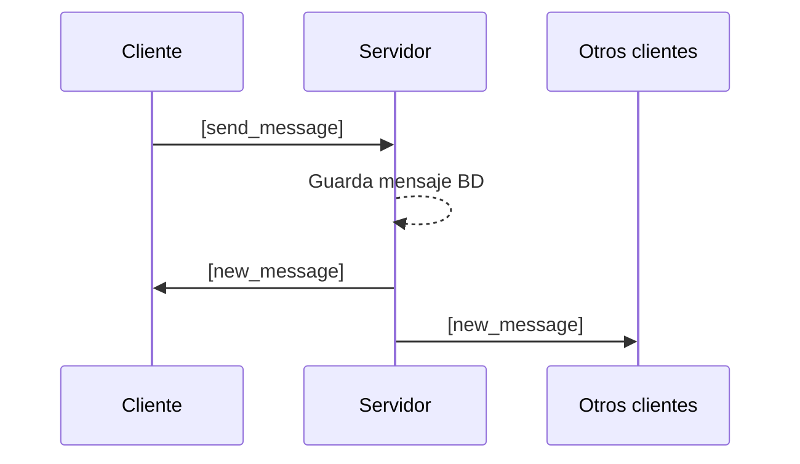
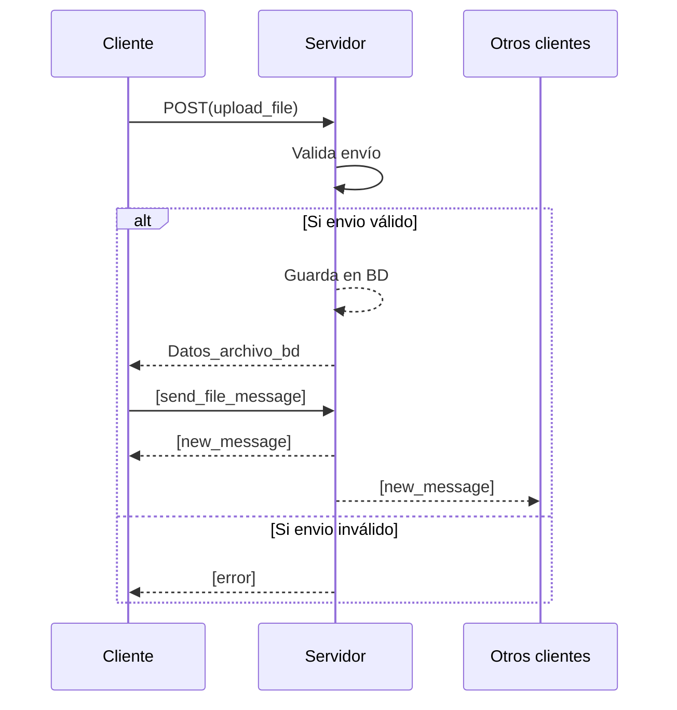
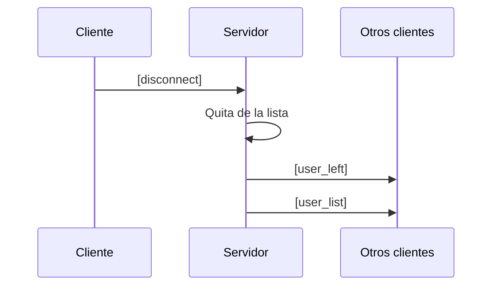

# Diagramas de Secuencia

## Flujo 1 - Conexión al servidor

```mermaid
    sequenceDiagram
    participant C as Cliente
    participant S as Servidor
    participant O as Otros clientes

    C->>S: POST(verify_pin)
    alt PIN válido
        S-->>C:Datos_sala
    else PIN inválido
        S-->>C:Acceso no autorizado
    end

    C->>S: [join_room]
    
    alt Si datos válidos
        S->>S: Datos válidos
        S-->>C: [room_joined]
    else Si datos inválidos
        S->>S: Datos inválidos
        S-->>C: [error]
    end

    S->>C: [user_list]
    S->>O: [user_list]
    S->>O: [user_joined]
```

## Flujo 2 - Envío de mensaje de texto

```mermaid
sequenceDiagram
    participant C as Cliente
    participant S as Servidor
    participant O as Otros clientes

    C->>S: [send_message]
    S-->>S: Guarda mensaje BD
    S->>C: [new_message]
    S->>O: [new_message]
```

## Flujo 3 - Enviar mensaje multimedia 

```mermaid
sequenceDiagram
    participant C as Cliente
    participant S as Servidor
    participant O as Otros clientes

    C->>S: POST(upload_file)

    S->>S: Valida envío

    alt Si envio válido
        S-->>S: Guarda en BD
        S-->>C: Datos_archivo_bd
        C->>S: [send_file_message]
        S-->>C: [new_message]
        S-->>O: [new_message]
    else Si envio inválido
        S-->>C: [error]
    end
```

## Flujo 4 - Desconexión

```mermaid
sequenceDiagram
    participant C as Cliente
    participant S as Servidor
    participant O as Otros clientes

    C->>S: [disconnect]
    S->>S: Quita de la lista
    S->>O: [user_left]
    S->>O: [user_list]
```

